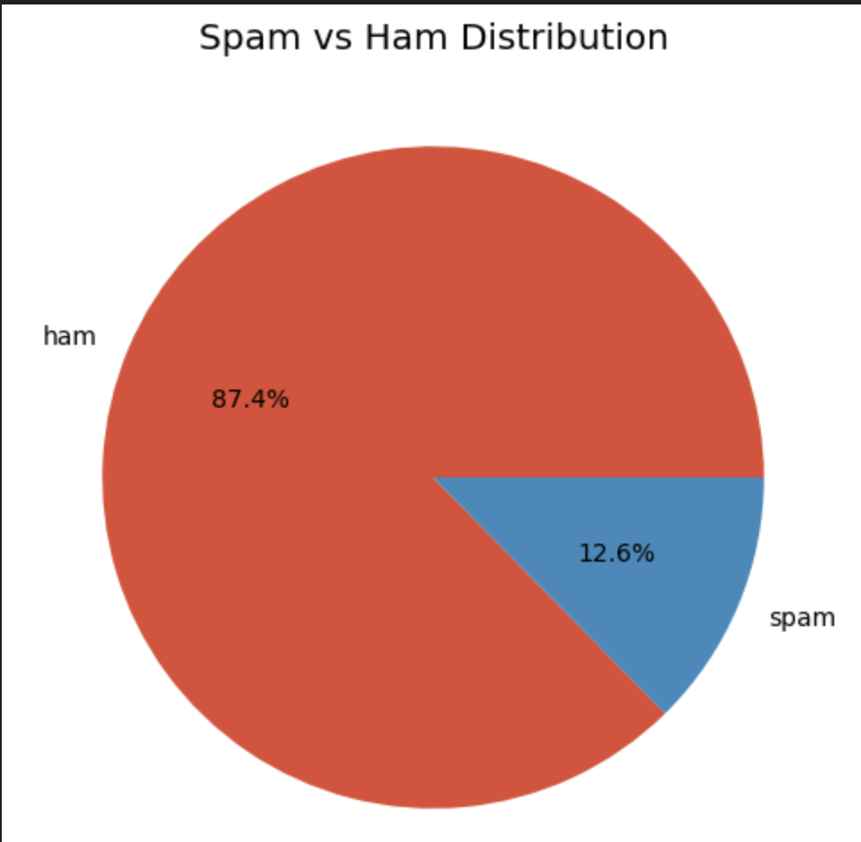
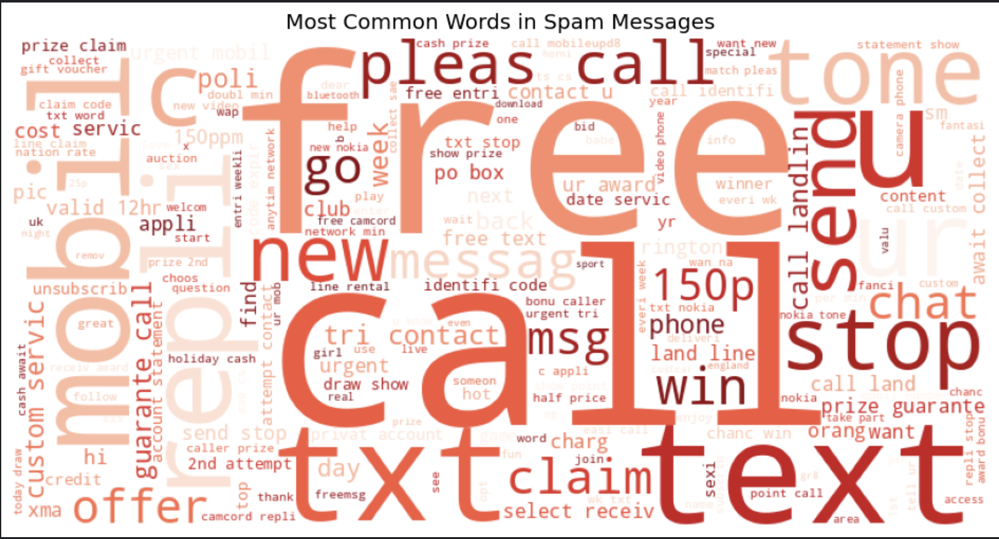
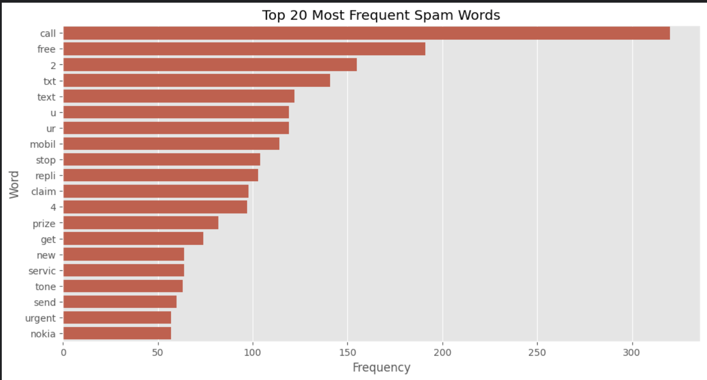
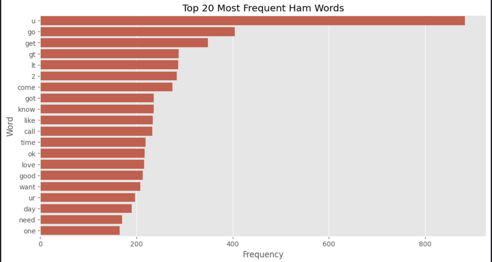
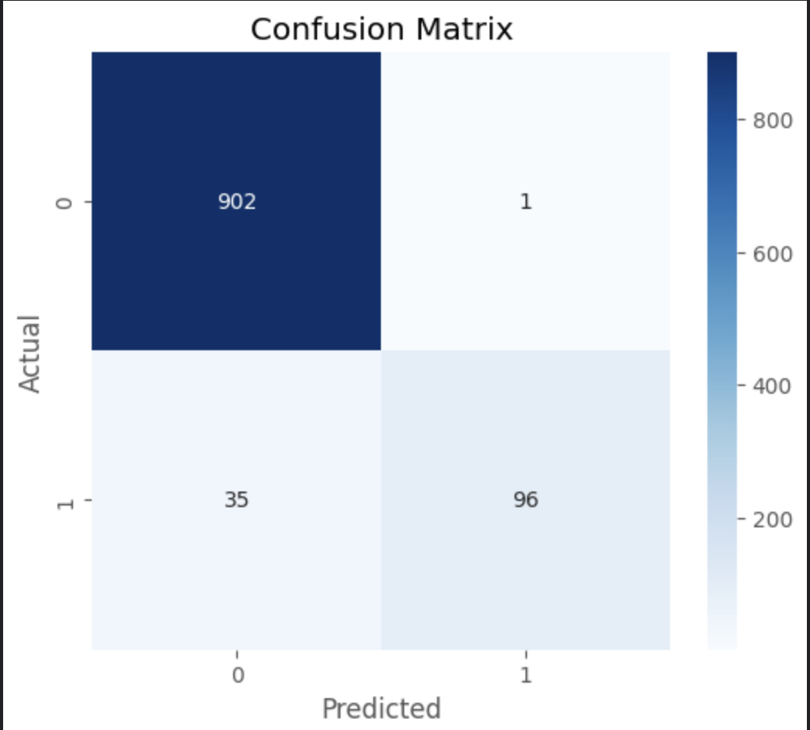
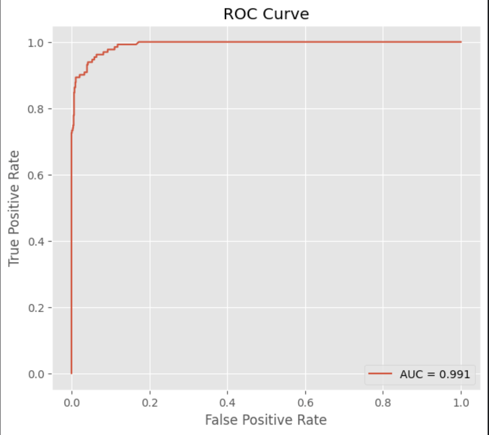

# 📧 Spam Email Detection using Classical Machine Learning


A complete end-to-end **Natural Language Processing (NLP)** project that detects spam SMS messages using classical machine learning algorithms.

The project explores the complete NLP workflow:

- 📊 Exploratory Data Analysis
- 🧹 Text Preprocessing
- 🔤 TF-IDF Feature Extraction
- 🤖 Multiple Machine Learning Models
- 📈 Model Benchmarking
- 🔍 Error Analysis
- 💾 Model Serialization

---

# 📌 Project Workflow

```text
SMS Dataset
      │
      ▼
Data Cleaning
      │
      ▼
Exploratory Data Analysis
      │
      ▼
Text Preprocessing

• Lowercase
• Tokenization
• Stopword Removal
• Punctuation Removal
• Stemming

      │
      ▼
Feature Engineering

• Character Count
• Word Count
• Sentence Count

      │
      ▼
TF-IDF Vectorization

      │
      ▼
Train/Test Split

      │
      ▼
Model Benchmark

├── Naive Bayes
├── Logistic Regression
├── Linear SVM
├── Random Forest
├── Gradient Boosting

      │
      ▼
Evaluation

Accuracy
Precision
Recall
F1 Score
ROC Curve
Confusion Matrix

      │
      ▼
Best Model

Linear SVM

      │
      ▼
Prediction System

      │
      ▼
Model Serialization
```

---

# 📊 Dataset

**SMS Spam Collection Dataset**

- 5,169 SMS messages (after cleaning)
- Binary Classification

Classes:

- ✅ Ham
- 🚨 Spam

---

# 📚 Technologies Used

- Python
- Pandas
- NumPy
- Matplotlib
- Seaborn
- NLTK
- Scikit-Learn
- Joblib

---

# 📂 Repository Structure

```text
spam-email-detection/
│
├── notebook/
│     spam-message-detector.ipynb
│
├── images/
│     class_distribution.png
│     spam_wordcloud.png
│     ham_wordcloud.png
│     spam_words.png
│     ham_words.png
│     confusion_matrix.png
│     roc_curve.png
│     svm_feature_importance.png
│
├── models/
│     linear_svm_spam_classifier.pkl
│     tfidf_vectorizer.pkl
│
├── requirements.txt
├── LICENSE
└── README.md
```

---

# 📸 Project Visualizations

## 📊 Class Distribution



---

## ☁️ Spam Word Cloud



---

## ☁️ Ham Word Cloud


---

## 📈 Most Frequent Spam Words



---

## 📉 Most Frequent Ham Words



---

## 🔲 Confusion Matrix



---

## 📈 ROC Curve



---

## 🔍 Most Important Spam Features


---

# 🏆 Model Benchmark

| Model | Accuracy | Precision | Recall | F1 Score |
|--------|---------:|----------:|--------:|---------:|
| **Linear SVM** | **97.97%** | **97.41%** | **86.26%** | **91.50%** |
| Random Forest | 97.58% | 99.07% | 81.68% | 89.54% |
| Naive Bayes | 97.00% | 98.08% | 77.86% | 86.81% |
| Logistic Regression | 96.23% | 100% | 70.22% | 82.51% |
| Gradient Boosting | 96.03% | 95.91% | 71.76% | 82.10% |

---

# 🎯 Key Findings

- TF-IDF effectively transformed textual information into numerical representations suitable for machine learning.
- Linear SVM achieved the best balance between precision and recall.
- Spam messages generally contain:
  - More words
  - More characters
  - Promotional keywords
- Classical Machine Learning remains highly effective for spam detection.

---

# 🚀 Prediction System

Example:

```python
predict_spam(
    "Congratulations! You've won a FREE iPhone!"
)
```

Output

```text
🚨 Spam
```

---

# 💾 Saved Models

The repository contains:

- Linear SVM Classifier
- TF-IDF Vectorizer

Both are serialized using Joblib and can be directly loaded for deployment.

---

# ⚙️ Installation

Clone the repository

```bash
git clone https://github.com/yourusername/spam-email-detection.git

cd spam-email-detection
```

Install dependencies

```bash
pip install -r requirements.txt
```

---

# ▶️ Running the Notebook

```bash
jupyter notebook
```

Open

```text
notebook/spam-message-detector.ipynb
```

Run all cells.

---

# 🚀 Future Improvements

- Hyperparameter Optimization
- Bi-gram & Tri-gram TF-IDF
- Lemmatization
- LSTM Spam Detection
- BERT-based Spam Classification
- Streamlit Deployment
- REST API using FastAPI

---

# ⭐ If you found this project useful

Please consider giving the repository a ⭐.
